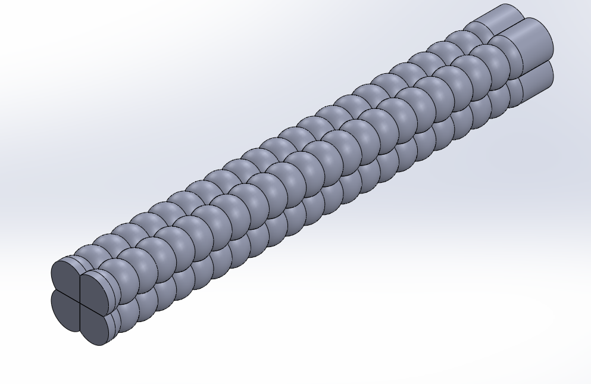
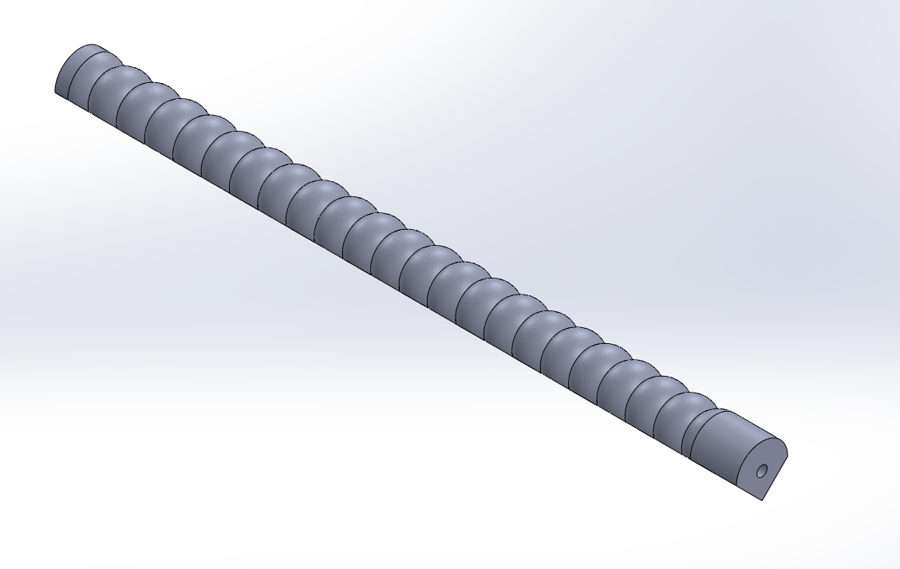
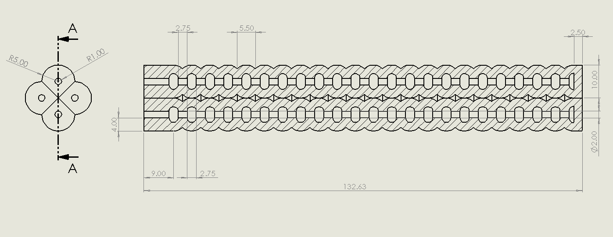
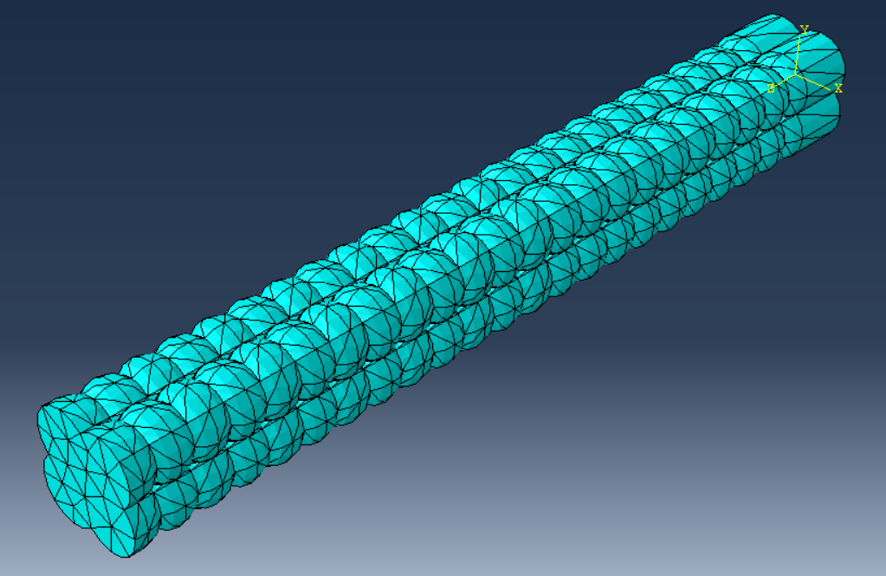
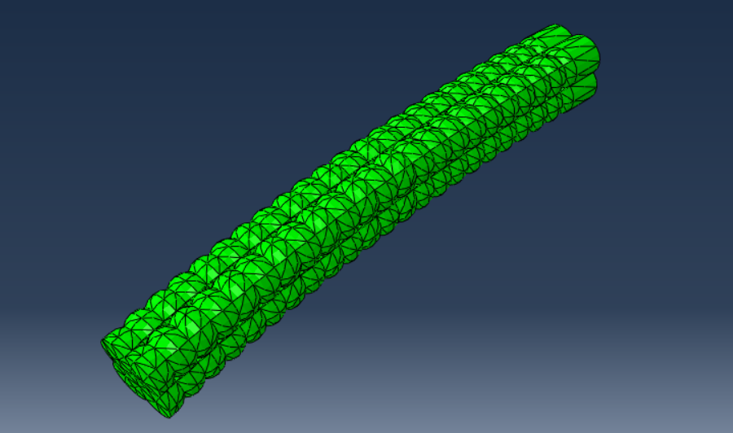
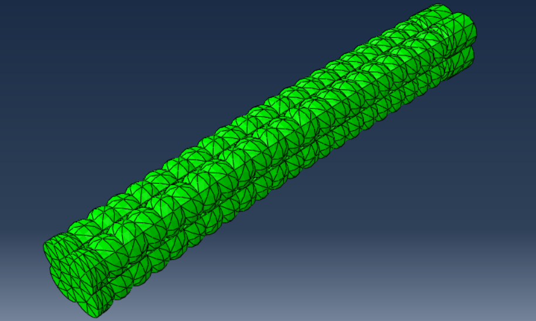
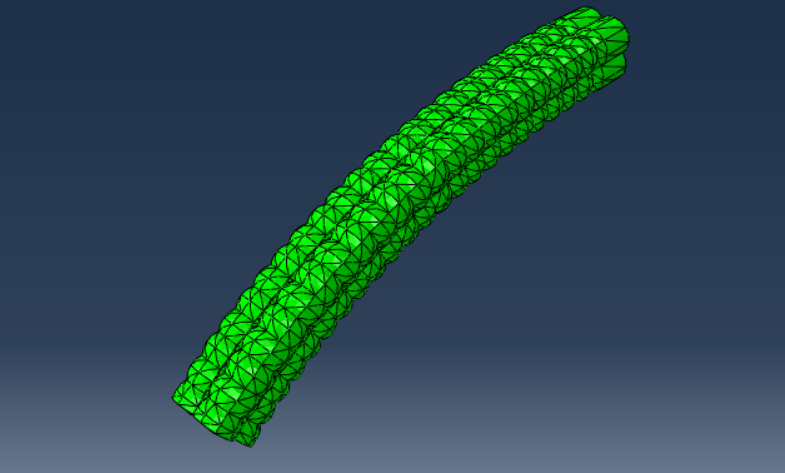
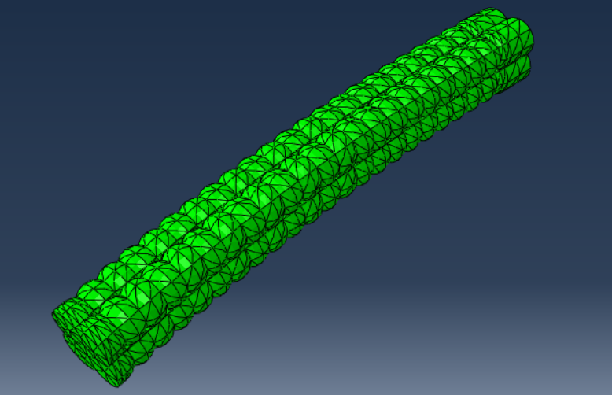

# Modular Pneu-Net Soft Pneumatic Actuator — Nonlinear FEA

Academic computational soft-robotics project focused on the CAD modeling and nonlinear finite element analysis of a modular Pneu-Net soft pneumatic actuator.

The project investigates how actuator wall thickness influences pressure-induced bending, deformation, and strain response using SolidWorks and Abaqus/Standard.

## Project Overview

Two actuator configurations were modeled with nominal wall thicknesses of:

- **2.0 mm**
- **2.5 mm**

The actuator geometry was developed in **SolidWorks**, exported in **STEP** format, and analyzed in **Abaqus/Standard** using a nonlinear static finite element model.

The study was inspired by the modular soft pneumatic actuator architecture reported by Elchrif et al. (2024), while the CAD models, simulation workflow, figures, and documentation in this repository were prepared as part of this undergraduate engineering project.

## Modeling Approach

The finite element model includes:

- **Abaqus/Standard — Static General**
- **Geometric nonlinearity:** `NLGEOM = ON`
- **Material model:** second-order Yeoh hyperelastic formulation
- **Yeoh coefficients:**
  - `C10 = 82,020 Pa`
  - `C20 = 96.9 Pa`
- **Element type:** quadratic hybrid tetrahedral elements (`C3D10H`)
- **Boundary condition:** fixed actuator base
- **Loading:** progressively applied internal pressure
- **Investigated wall thicknesses:** 2.0 mm and 2.5 mm

The numerical study considered multiple internal-pressure cases to compare the pressure-dependent response of the two actuator geometries.

## CAD Model

### Modular actuator assembly



### Actuator module



### 2.5 mm actuator drawing



## Finite Element Model

### Tetrahedral mesh



The actuator was discretized using a free tetrahedral mesh with hybrid quadratic tetrahedral elements to support the nearly incompressible hyperelastic material formulation.

## Representative Results

### Pressure-induced deformation at 20 kPa

| 2.0 mm wall thickness | 2.5 mm wall thickness |
| --- | --- |
|  |  |

### Pressure-induced deformation at 35 kPa

| 2.0 mm wall thickness | 2.5 mm wall thickness |
| --- | --- |
|  |  |

Across comparable pressure levels, the **2.0 mm configuration exhibited greater compliance and more pronounced deformation**, while the **2.5 mm configuration showed a comparatively stiffer response**.

## Repository Structure

```text
modular-pneunet-actuator-fem/
├── design/
│   ├── solidworks/          # Native SolidWorks CAD files
│   └── step/                # Exchange-format CAD models
├── docs/
│   └── PneuNet_Actuator_FEA_Report.pdf
├── references/
│   └── README.md            # Main literature reference
├── results/
│   └── figures/
│       ├── cad/
│       ├── deformation/
│       ├── displacement/
│       └── mesh/
├── .gitignore
├── LICENSE.md
└── README.md
```

## Full Report

A detailed description of the CAD development, finite element methodology, simulation cases, and results is available here:

**[PneuNet Actuator FEA Report](docs/PneuNet_Actuator_FEA_Report.pdf)**

## Reference Design

The main design inspiration for this project is:

A. R. Elchrif, M. I. Awad, S. A. Maged, and A. Ramzy,  
“Modular soft pneumatic actuator mimics elephant trunk locomotion,”  
*Scientific Reports*, vol. 14, Art. no. 24169, 2024.  
DOI: [10.1038/s41598-024-74105-0](https://doi.org/10.1038/s41598-024-74105-0)

Additional citation information is provided in [`references/README.md`](references/README.md).

## Scope and Limitations

This repository documents a **computational undergraduate engineering project**. The study focuses on CAD development and nonlinear finite element analysis.

The project does **not** include actuator fabrication, experimental material calibration, experimental validation, or human-subject testing. The results should therefore be interpreted as a preliminary computational design study rather than validated device-level performance.

Higher-pressure simulations can also become increasingly sensitive to nonlinear convergence, which is expected in highly deformable hyperelastic pneumatic structures.

## Author

**Aryan Mollazadeh**  
B.Sc. Mechanical Engineering  
Sharif University of Technology

## License

The original project materials in this repository are provided for academic, educational, and portfolio review purposes. See [`LICENSE.md`](LICENSE.md) for details.
